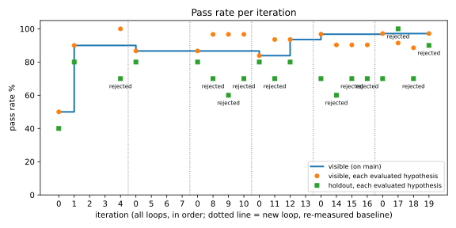
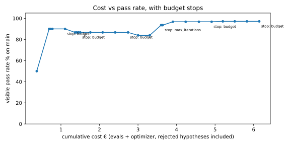

# harness-loop

An optimizer agent that improves another agent by iterating on evals. It proposes one hypothesis,
edits a prompt file on a git branch, re-runs the eval suite, keeps the change or rolls it back, and
records the result. Then it does it again, until the gains stop paying for themselves.

The shape of the loop is not new; [Prior art](#prior-art) says where it comes from. What this repo
is about is the part that usually gets waved through: the rule that decides whether a change is kept.
The common version is a tolerance band on aggregate accuracy. Mine has to clear three separate bars,
one of them on cases the optimizer never sees, confirmed by a second run.

Every number below comes out of a JSON file committed in `evals/results/`. A number without a file
behind it is a bug.

**In short.** 44 eval cases, 6 loops, 19 hypotheses, about €8.7 of API spend. The loop took the agent
from 45% to 87% (91% under the corrected judge); one change accepted by a human over the gate took it
to 98%. The findings that matter more than the curve: a single-run gate let a regression through,
the rubric moved the score more than most hypotheses did, and most of the gain came from one edit.
`uv sync --group dev && uv run pytest -q` runs the 81 offline tests without an API key.

## Setup

The agent under test answers questions about an invented SME ledger in SQLite (8 customers, 24
invoices, 13 payments, reference date fixed at 2026-09-01) using three tools plus a structured
`final_answer`. It starts with a one-sentence system prompt ("You are an assistant for a small
company's accounting ledger. Answer the user's question using the tools. Today is {as_of}.") and
one-line tool descriptions, so it doesn't know the schema and never refuses anything. The prompt
files committed here are the final state; to rerun the loop from the start, put those one-liners
back. That's the surface the optimizer works on, and
the only surface: it can read the tool code, it can only write the two prompt files.

The eval set is 44 hand-written cases in four categories, 34 visible to the optimizer and 10 held
out. Most checks are deterministic; reasoning cases go to an LLM judge scoring against a reference
written from the data. Six loops ran over two days: 19 hypotheses, about €8.7 of API spend (€6.15
inside the loops, €2.59 in standalone runs), one results file per evaluated iteration.

## Results

| | total | visible | holdout | |
|---|---|---|---|---|
| starting prompt | 45% | 47% | 40% | [file](evals/results/2026-09-16T143601+0000.json) |
| after the loop, judge v1, 40 cases | 87% | 94% | 67% | mean of 3 replications |
| same prompts, judge v2, 44 cases | 91% | 97% | 70% | mean of 3 replications |
| plus one hypothesis accepted by hand over the gate | 98% | 100% | 90% | [file](evals/results/2026-09-17T212958+0000.json) |

Rows two and three are the same agent measured two ways: the 4-point difference between them is the
corrected rubric plus four added cases, not behaviour. Row four is a human overriding a gate decision, kept as a separate row so the
loop's own curve stays clean.





Per-loop tables, every hypothesis and every verdict: [docs/loops.md](docs/loops.md).

## Findings

**The gain is concentrated in one hypothesis.** Hypothesis 1 moved the visible rate from 50% (the
loop's own baseline run) to 90%
and refusals from 0% to 100% in a single edit: the optimizer read `ledger.py` and `tools.py`, worked
out that the agent had no schema, and wrote the schema, the overdue arithmetic and the refusal policy
into the system prompt. The remaining 18 hypotheses produced one accepted change between them. Most
of the value of this kind of loop appears to be in finding the first missing thing.

**Single-run gating is unsound at this resolution.** With 10 holdout cases, one case is 10 points,
and measured run-to-run noise was about one case. Hypothesis 12 passed the gate with the holdout at
80%; three replications of those exact prompts put it at 67%, with the same case (`F08`) failing each
time. An idea the gate had rejected on the holdout five times (hypotheses 4 and 8 to 11) passed on the
sixth because of sampling, not because of the change. The loop now re-runs the holdout before accepting and takes the lower of
the two runs as the new bar, which costs about $0.10 per acceptance.

**The judging rubric moves the score more than most hypotheses do.** Judge v1 flagged any figure not
literally present in the tool outputs, so "5,250 outstanding" failed when `run_sql` had returned
3,750 and 1,500 separately. Judge v2 accepts sums, differences and counts as grounded. Same agent,
same seed: +4 points total (the rubric plus four added cases), and run-to-run flips went from 1 case in 40 to 0 in 44. Results files
carry `judge_version` so numbers either side of that change are never pooled.

**The optimizer only fixes what it can see.** Refusal failures of the prediction and external-fact
kind sat in the holdout for five loops and were never targeted, because the optimizer is shown
visible failures only. Adding one visible case of that class produced a working fix within three
iterations, and in one run that fix repaired both held-out cases as well; on the confirmation run
`F08` failed again (see below). Split design is not just an
anti-overfitting device; it also decides what the loop is capable of noticing.

**Rejections outnumber acceptances several times over, and that's the working state.** Of 19
hypotheses: 2 accepted by the loop, 5 rejected on the holdout, 6 on no visible gain (one of them,
hypothesis 19, later accepted by a human over the gate), 6 refused before any eval ran. The budget rule ended five of the six loops, each
time after three flat iterations.

**The residual noise is in the structured flag, not the judge.** After the rubric fix, three
back-to-back runs of the same prompts agree on all 44 cases. Across two runs of the final prompts,
though, `F08` and `F12` swap their `refused` flag: the agent declines in the right words and sometimes
leaves `refused=false`. The check demands the flag deliberately, because a refusal the
caller can't detect isn't a refusal, so this is a real property of the agent rather than measurement
error. It is also the last failing case.

## Limitations

The dataset is small and single-domain: 44 cases, one ledger, one provider, one agent. Holdout
resolution is 10 points per case, so any claim about a 1-case difference is at the noise floor.

Two accepted hypotheses is a small sample. Statements here about what the gate prevents are backed by
its rejections, which are more numerous, not by a controlled comparison against a loop running
without it.

The per-category gate never fired in 19 hypotheses. Nothing raised the total while lowering a visible
category, so that rule has unit tests and no field evidence.

The optimizer and the judge share a model family. Three of the four
eval categories are deterministic and can't be flattered, and judged cases are scored against
hand-written references at temperature 0, but the risk is structural and worth naming.

The holdout is partly adaptive. The optimizer never sees held-out cases, but its context includes
the changelog, so it sees when a hypothesis was rejected on the holdout and by how much, and its
prompt tells it to shrink such a change. Five holdout rejections of one idea followed by an
acceptance on a lucky run is what that looks like; the confirmation run is the defence, not a proof.

The anti-leak check, which refuses hypotheses that write an expected answer into the prompt, had two
false-positive bugs. It first scanned every visible case including passing ones, so a list of ISO
codes containing `Switzerland` was refused five times (€0.21) before the scope was narrowed to
failing cases; later a year inside a date (`2026`) was refused once, fixed by exempting years.

## Running it

Without `just`, every target is one line in the `justfile`: `uv run pytest -q` runs the tests.

```bash
uv sync --group dev
cp .env.example .env   # LLM_API_KEY; the default endpoint is Anthropic, any OpenAI-compatible base URL works
just test              # unit tests, no API key needed
just evals             # 44 cases, about $0.34, writes evals/results/<timestamp>.json
just loop 6            # baseline plus up to 6 hypotheses, about €0.32 per evaluated iteration
just feedback          # the feedback endpoint on :8765
```

The loop refuses to start on a dirty working tree, so every number is committed alongside the code
that produced it. This public repository is a single-commit snapshot of the working repository: the
per-hypothesis branches and the SHAs in `CHANGELOG.md` and in each results file are not published
here; the results files are. Accepted hypotheses fast-forward `main`; rejected ones leave their branch as
`hyp/<n>` and only the evidence lands on `main`.

Temperature is 0 everywhere and `EVAL_SEED` is passed to the provider, though the Anthropic endpoint
ignores it. `scripts/plot.py` regenerates the charts from the loop files; `scripts/variance.py` takes
any number of results files and reports min/mean/max plus the cases that disagree.

## Implementation

`src/optimizer/loop.py` is a LangGraph graph: baseline, propose, apply, evaluate, decide. The
optimizer (Sonnet 4.6) is shown the current prompts, the agent's code, the pass rate per category,
every failing visible case with the agent's answer and tool calls, and the changelog of what's
already been tried. It returns one hypothesis: one target file and its complete new content. Two
static checks run before any eval is spent, on length and on leaked expected values.

The gate keeps a hypothesis only if the visible rate rises, no category loses more than one visible
case (tolerance `1/n`, computed from the dataset), and the holdout doesn't fall on two separate runs.
Cost per iteration is computed from token usage against a local price table, includes the optimizer's
own tokens and every rejected hypothesis, and drives the stop rule.

The optimizer can also propose eval cases. They land in `evals/proposed.yaml` and stay there until a
human moves them, because a loop that writes its own exams isn't measuring anything. Cases in the
dataset get added, never weakened, and that rule held for the whole project.

`POST /feedback` takes a run's trace id and a note. A dataset case doubles in weight and the note
appears beside the failure the optimizer reads; an ad-hoc question becomes a new judged case with the
note as its reference. A case flagged this way, failing since loop 1, came back two iterations later,
and the loop records that number itself.

Langfuse is optional: with keys, each eval run of each case is one trace carrying the case, the
verdict and the cost. The trace id is derived locally either way, which is what lets the feedback
endpoint find a run again without it.

## Prior art

The loop is not new, and nothing here claims it is. Its most visible public instance is Karpathy's
[autoresearch](https://github.com/karpathy/autoresearch) (March 2026), which popularised a pattern
VeRO had already published a month earlier; the same primitive shows up in the literature under
several names. Writing it down for anyone who knows the field:

- **The primitive.** An agent that edits a target agent's harness, evaluates it under a budget and
  keeps versioned snapshots is published as [VeRO](https://arxiv.org/abs/2602.22480) (Feb 2026);
  [HarnessOpt-Bench](https://arxiv.org/abs/2608.06301) (Aug 2026) benchmarks frontier models at that
  job and keeps every candidate version for audit.
- **The gate.** [Self-Harness](https://arxiv.org/abs/2606.09498) accepts a modification only after
  regression testing, and reports held-in and held-out pass rates both improving, which is the same
  instinct as the rule here.
  [GRASP](https://arxiv.org/abs/2605.29668) (EMNLP 2026) admits a candidate on a balanced held-out
  probe stratified by task type under a hard regression budget, which is the nearest published thing
  to a per-category gate. [GEPA](https://arxiv.org/abs/2507.19457) keeps a Pareto front over
  individual instances, but to choose the next parent, not to accept.
- **The optimizers.** [OPRO](https://arxiv.org/abs/2309.03409) hill-climbs on a scored history with
  no rollback; [DSPy MIPROv2](https://arxiv.org/abs/2406.11695) runs Bayesian optimization over
  instruction and demo combinations; [TextGrad](https://arxiv.org/abs/2406.07496) backpropagates
  natural-language gradients and accepts every step. All of them optimize more systematically than a
  single hypothesis per iteration.
- **The result I reproduced without meaning to.**
  [HarnessDev](https://arxiv.org/abs/2609.01437) (Sep 2026) reports that evolution gains on the
  visible set often shrink or reverse on held-out tasks. Five of my nineteen hypotheses were rejected
  for exactly that, before I had read it.
- **The critique this design has to answer.** [ACE](https://arxiv.org/abs/2510.04618) names *context
  collapse*: an optimizer that regenerates a whole prompt each round drifts towards shorter, blander
  text and loses detail. Hypotheses here are full-file rewrites (a deliberate choice, because
  LLM-written diffs corrupt whitespace), so the length cap is the only thing standing against it and
  no measurement here rules it out.

Eval-driven development, LLM-as-a-judge, a branch per hypothesis and a second loop over production
traces are common background too. What is mine is the accept rule and what hangs off it: the cost
budget that decides when to stop, the per-category and holdout gate, the confirmation run, and user
feedback turned into weighted eval cases with a measured recovery time.

What is left after all that is not the loop. It is the accept rule when the eval suite is small,
noisy and expensive, which is the regime my 44 cases are in, and where one case is worth ten points.
The findings above are about that, and so are the three additions.

## Next

Present in the code but not yet measured, so no number above depends on them:

- `just loop 6 main --archive` lets a hypothesis start from a branch rejected since the last
  acceptance instead of from `main`. The default is the greedy loop that produced the results above.
- `evals/generate.py` and `evals/dataset.py` generate candidate cases with the expected value
  computed from the ledger in SQL, track each case's provenance and coverage, and queue them for
  human review. `just select`, `just dataset-report` and `just generate` drive them.
- An optional TypeSafe Jev classifier (`src/jev.py`) can read a refusal from the answer text and act
  as a semantic anti-leak check. It is off without `TYPESAFE_API_KEY`; every result above was
  produced without it.

Design choices and the reasons behind them: [DESIGN.md](DESIGN.md).

## License

MIT.
